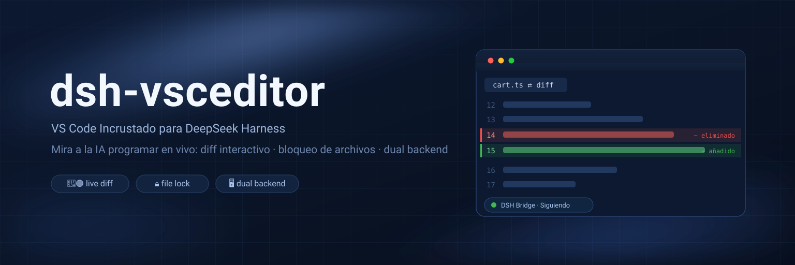

# dsh-vsceditor



[English](README.md) | [简体中文](README.zh.md) | [Português (Brasil)](README.pt-BR.md) | **Español**

**Plugin de editor VS Code incrustado para DeepSeek Harness** — integra un code-server completo (VS Code en su totalidad) dentro de la interfaz web de DSH. Cada vez que el agente escribe o modifica un archivo, el editor abre automáticamente una vista de diff rojo/verde y salta a la primera línea modificada — permitiéndote ver cómo trabaja la IA en tiempo real.

## 1. Características

- **Dos backends: incrustado / local** — code-server incrustado por defecto; o cambia a **VS Code local** para llevar el modo seguimiento, diffs y bloqueo a tu editor de escritorio
- **VS Code real, no un editor básico** — el backend incrustado es code-server 4.x (núcleo completo de VS Code): extensiones, temas, atajos de teclado y panel de Git funcionan a la perfección
- **Modo Seguimiento (Follow mode)** — cuando el agente ejecuta `write`/`edit`, el editor abre la vista diff del archivo y se desplaza a la primera línea cambiada; DSH también muestra una pestaña de diff de solo lectura
- **Bloqueo de archivos** — mientras el agente escribe en un archivo, este se convierte en solo lectura en el editor (evitando conflictos de sobrescritura entre tú y la IA), desbloqueándose automáticamente al finalizar
- **El espacio de trabajo sigue a la sesión** — un único proceso DSH ejecuta un code-server; cuando cambia el espacio de trabajo de la sesión activa, el editor se ajusta automáticamente al directorio correspondiente
- **iframe persistente** — la página del editor permanece anclada al `<body>`; cambiar de pestaña solo la oculta/muestra sin reiniciar la sesión de VS Code en cada clic
- **Integración con Configuración** — tarjeta desplegable en Configuración → Plugins → Configuración de Plugins: seguimiento, autoarranque, puerto, directorio de code-server e idioma de interfaz (`~/.dsh/settings.yaml`)
- **Soporte Multilingüe (i18n)** — soporte nativo para Español (`es`), English (`en`), 简体中文 (`zh`) y Português-BR (`pt-BR`), con detección automática del navegador
- **Cero dependencias** — host y client desarrollados en JavaScript puro sin dependencias npm externas; esquema de configuración compatible con schemastery sin requerir `@deepseek-ai/schemastery`

## 2. Cómo Funciona

```
┌─ Proceso DSH ──────────────────────────────────────────┐
│  host.js (plugin cordis en host plane, singleton)      │
│   · escucha eventos tools/pre-execute y tools/result   │
│     de todas las sesiones                              │
│   · captura rutas de escritura/edición (antes/después) │
│   · gestiona el proceso code-server (spawn/restart)    │
│   · expone vía webServer:                              │
│       /__dsh-vsceditor/state|action   (plano control)  │
│       /__dsh-vsceditor-<rand>/events  (SSE → extensión)│
│       /__dsh-vsceditor-<rand>/rpc     (extensión → host│
└───────┬──────────────────────────────▲─────────────────┘
        │ SSE: hello/follow/edit/lock/unlock/reveal
        │                              POST: ready/ack/log
┌───────▼──────────────────────────────┴─────────────────┐
│  code-server (proceso separado, --auth none, 127.0.0.1) │
│   └─ extensión dsh-bridge (vscode-ext/dsh-bridge)      │
│        mensaje edit → abre diff en la línea modificada │
│        lock → archivo solo lectura; unlock → restaura  │
└────────────────────────────────────────────────────────┘
        ▲ iframe (client.js registra en conversation.view
          la pestaña "Editor", persistente en body)
```

## 3. Requisitos

- DeepSeek Harness (dsh) web profile (este plugin es un profile bundle montado en host plane)
- macOS o Linux (Windows soportado vía WSL2 o script experimental de PowerShell)
- **Modo Incrustado**: instalación de code-server (ver sección 4.2); **Modo VS Code Local**: VS Code de escritorio. Se requiere al menos uno de los dos — **el plugin funciona sin code-server en modo VS Code local**

## 4. Instalación

### 4.1 Instalar el plugin

**Opción A: desde GitHub (recomendado)**

```sh
dsh plugin --profile web add github:k-ying/dsh-vsceditor
```

**Opción B: desde un directorio local**

```sh
git clone https://github.com/k-ying/dsh-vsceditor.git
dsh plugin --profile web add /ruta/a/dsh-vsceditor
```

### 4.2 Instalar code-server (requerido para el modo incrustado)

> ⚠️ **No omitas este paso si deseas usar el editor incrustado por defecto.** El plugin no incluye el runtime de code-server (~100MB). Sin él, la pestaña Editor te indicará que no se encontró code-server y te sugerirá cambiar al **modo VS Code local** (con funcionalidad equivalente, ver 5.1).

**Opción 1: instalación con un clic (recomendada).** Abre la pestaña **Editor** (o Configuración → Plugins → Configuración de Plugins) y pulsa **「⬇ Instalar code-server」**: un diálogo muestra la URL de descarga, el porcentaje de progreso en vivo y los pasos de instalación/arranque (se puede cancelar en cualquier momento), y el editor se abre automáticamente al terminar. Se instala en `~/.dsh-editor`, compartido por todos los espacios de trabajo.

**Opción 2: instalación global por línea de comandos** (equivalente; útil cuando el panel no está accesible):

```sh
sh ~/.dsh/profiles/web/node_modules/dsh-vsceditor/scripts/install-code-server.sh ~/.dsh-editor
```

Para instalarlo en un espacio de trabajo específico:

```sh
cd <tu-workspace-dsh>
sh ~/.dsh/profiles/web/node_modules/dsh-vsceditor/scripts/install-code-server.sh
```

El script descarga y descomprime la versión oficial de code-server (versión fijada a 4.133.0, personalizable con `DSH_VSCEDITOR_VERSION`).

> 📁 **Los datos de ejecución del editor (user-data, configuración, logs) NO se guardan en tu workspace** — viven en el directorio global `~/.dsh-editor/workspaces/<hash>-<nombre-del-workspace>/`, aislados por workspace (el mismo modelo que el directorio de datos de usuario de VS Code), así que tu carpeta de proyecto permanece limpia. Las versiones antiguas usaban `<workspace>/.dsh-editor`; los workspaces que ya lo tienen lo siguen usando para conservar sus datos.

### 4.3 Inicio

```sh
dsh web
```

Aparecerá la pestaña **Editor** en la barra superior. El punto indicador de estado: gris = cargando, verde = conectado, amarillo = esperando conexión, rojo = detenido / no instalado.

## 5. Uso

### 5.1 Modo VS Code Local

Cambia el **Backend del editor** a **VS Code local** en Configuración → Plugins → Configuración de Plugins, o pulsa el botón **Asistente de conexión** en la pestaña Editor:

1. El plugin detecta automáticamente la instalación de VS Code en el sistema.
2. Si la extensión no está instalada, pulsa **Instalar extensión en VS Code local** para copiarla a `~/.vscode/extensions/`.
3. Recarga la ventana en VS Code (`Reload Window`) y **abre el mismo espacio de trabajo de la sesión de DSH**.
4. A partir de ese momento, el seguimiento y el bloqueo de archivos operan idénticamente al modo incrustado.

### 5.2 Modo Seguimiento (Follow Mode)

Activado por defecto. Tras cada `write`/`edit` del agente:

- El editor muestra la vista de diff (izquierda: antes, derecha: actual) y se posiciona en la primera línea cambiada.
- La casilla **Seguir ediciones de DSH** en la barra de herramientas permite activar/desactivar el modo en cualquier momento.

### 5.4 Tarjeta de Configuración

Configuración → Plugins → Configuración de Plugins → "Editor VS Code incrustado":

| Opción | Tipo | Defecto | Descripción |
|---|---|---|---|
| `editorBackend` | string | `embedded` | Backend del editor: `embedded` = code-server incrustado; `local` = VS Code local |
| `follow` | boolean | `true` | Seguir ediciones de DSH: muestra el diff y salta a la línea modificada |
| `followWorkspaceOnly` | boolean | `false` | Seguir solo archivos del workspace: cambios externos solo se registran en recientes |
| `autoStart` | boolean | `true` | Iniciar code-server automáticamente al arrancar DSH |
| `port` | number | `0` | Puerto de escucha de code-server; `0` = aleatorio (18200–18900) |
| `codeServerHome` | string | `""` | Directorio de instalación de code-server; vacío = detección automática |
| `vscodePath` | string | `""` | Ruta del ejecutable de VS Code local; vacío = detección automática |
| `language` | string | `auto` | Idioma de la interfaz: `auto` = seguir el idioma del navegador; o `zh`, `en`, `pt-BR`, `es` |
| `language` | string | `auto` | Idioma de interfaz: `auto` = según el navegador; o `zh`, `en`, `pt-BR`, `es` |

## License

[MIT](LICENSE)
