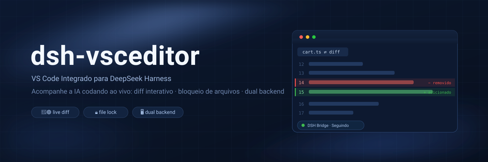

# dsh-vsceditor



[English](README.md) | [简体中文](README.zh.md) | **Português (Brasil)** | [Español](README.es.md)

**Plugin de editor VS Code integrado para o DeepSeek Harness** — incorpora um code-server completo (VS Code na íntegra) na interface web do DSH. Toda vez que o agent cria ou edita um arquivo, o editor abre automaticamente uma visualização de diff vermelho/verde e salta para a primeira linha alterada — você literalmente acompanha o trabalho da IA em tempo real.

## 1. Funcionalidades

- **Dois backends: integrado / local** — code-server embutido por padrão; ou mude para **VS Code local** e leve o modo seguir, diffs e bloqueio de arquivos para o seu próprio editor desktop
- **VS Code real, não um editor simplificado** — o backend integrado é o code-server 4.x (núcleo completo do VS Code): extensões, temas, atalhos de teclado e painel Git funcionam perfeitamente
- **Modo Seguir (Follow mode)** — quando o agent executa `write`/`edit`, o editor abre o diff do arquivo e rola até a primeira linha modificada; o DSH também exibe uma aba de diff somente leitura nativa
- **Bloqueio de arquivos** — enquanto o agent escreve em um arquivo, ele fica como somente leitura no editor (evitando conflitos de sobrescrita entre você e a IA); o desbloqueio é automático ao término da escrita
- **Workspace segue a sessão** — um único processo DSH gerencia um code-server; quando o workspace da sessão ativa muda, o editor alterna para o diretório correspondente (reiniciando o code-server se necessário)
- **iframe persistente** — a página do editor fica acoplada ao `<body>`; alternar entre abas apenas oculta/exibe o container sem reiniciar a sessão do VS Code a cada clique
- **Integração com Configurações** — card expansível em Configurações → Plugins → Configuração de Plugins: alternância de modo seguir, início automático, porta, diretório do code-server e idioma da interface (`~/.dsh/settings.yaml`)
- **Suporte Multilíngue (i18n)** — suporte nativo a Português do Brasil (`pt-BR`), Inglês (`en`), Chinês Simplificado (`zh`) e Espanhol (`es`), com detecção automática do navegador
- **Zero dependências** — host e client construídos em JavaScript puro sem pacotes npm externos; schema de configurações compatível com o formato schemastery sem exigir `@deepseek-ai/schemastery`

## 2. Como Funciona

```
┌─ Processo DSH ─────────────────────────────────────────┐
│  host.js (plugin cordis no host plane, singleton)      │
│   · escuta eventos tools/pre-execute e tools/result    │
│     de todas as sessões                                │
│   · captura caminhos de escrita/edição (antes/depois)  │
│   · gerencia o processo code-server (spawn/restart)    │
│   · expõe via webServer:                               │
│       /__dsh-vsceditor/state|action   (plano controle) │
│       /__dsh-vsceditor-<rand>/events  (SSE → extensão) │
│       /__dsh-vsceditor-<rand>/rpc     (extensão → host)│
└───────┬──────────────────────────────▲─────────────────┘
        │ SSE: hello/follow/edit/lock/unlock/reveal
        │                              POST: ready/ack/log
┌───────▼──────────────────────────────┴─────────────────┐
│  code-server (processo separado, --auth none, 127.0.0.1)│
│   └─ extensão dsh-bridge (vscode-ext/dsh-bridge)       │
│        mensagem edit → abre diff na linha alterada     │
│        lock → arquivo somente leitura; unlock → restaura│
└────────────────────────────────────────────────────────┘
        ▲ iframe (client.js registra em conversation.view
          a aba "Editor", persistente no body)
```

A semântica de mensagens segue o padrão ACP `session/update`: `edit {path, oldText, newText, firstLine}` é enviado pelo host com as estatísticas de diff calculadas; a extensão realiza a renderização nativa.

## 3. Requisitos

- DeepSeek Harness (dsh) web profile (este plugin é um profile bundle montado no host plane)
- macOS ou Linux (Windows suportado via WSL2 ou script PowerShell experimental)
- **Modo Integrado**: instalação do code-server (ver seção 4.2); **Modo VS Code Local**: VS Code desktop instalado. Você precisa de pelo menos um dos dois — **o plugin funciona sem code-server no modo VS Code local**

## 4. Instalação

### 4.1 Instalar o plugin

**Opção A: via GitHub (recomendado)**

```sh
dsh plugin --profile web add github:k-ying/dsh-vsceditor
```

O comando `dsh plugin add` adiciona o pacote às dependências de `~/.dsh/profiles/web/package.json` e registra automaticamente em `dsh.profile.bundles` (o plugin se automonta via `cordis.patch.yml`).

**Opção B: a partir de um diretório local**

```sh
git clone https://github.com/k-ying/dsh-vsceditor.git
dsh plugin --profile web add /caminho/para/dsh-vsceditor
```

### 4.2 Instalar o code-server (necessário para o modo integrado)

> ⚠️ **Não pule esta etapa se quiser usar o editor integrado padrão.** O plugin não inclui o runtime do code-server (~100MB). Sem ele, a aba do Editor indicará que o code-server não foi encontrado e oferecerá alternar para o **modo VS Code local** (com as mesmas funcionalidades, veja 5.1).

**Opção 1: instalação com um clique (recomendada).** Abra a aba **Editor** (ou Configurações → Plugins → Configuração de Plugins) e clique em **「⬇ Instalar code-server」**: um diálogo mostra a URL de download, a porcentagem de progresso em tempo real e as etapas de instalação/inicialização (cancelável a qualquer momento), e o editor abre automaticamente ao concluir. Instala em `~/.dsh-editor`, compartilhado por todos os workspaces.

**Opção 2: instalação global via linha de comando** (equivalente; útil quando o painel não está acessível):

```sh
sh ~/.dsh/profiles/web/node_modules/dsh-vsceditor/scripts/install-code-server.sh ~/.dsh-editor
```

Para instalar em um workspace específico, execute sem argumentos (instala em `.dsh-editor` no diretório atual):

```sh
cd <seu-workspace-dsh>   # ex.: ~/Documents/AI
sh ~/.dsh/profiles/web/node_modules/dsh-vsceditor/scripts/install-code-server.sh
```

O script baixa e descompacta a versão oficial do code-server para a sua plataforma (macOS arm64/x64, Linux x64/arm64/armhf). A versão padrão é 4.133.0 (personalizável via variável `DSH_VSCEDITOR_VERSION`).

A instalação manual também é suportada: descompacte o code-server em um dos locais abaixo (em ordem de prioridade):

1. Campo `Diretório do code-server` nas configurações do plugin
2. Variável de ambiente `$DSH_VSCEDITOR_HOME`
3. `<workspace>/.dsh-editor` (nível de workspace)
4. `~/.dsh-editor` (nível global, recomendado)

O diretório deve conter o executável `code-server/bin/code-server`.

> 📁 **Os dados de execução do editor (user-data, configuração, logs) NÃO ficam no seu workspace** — ficam no diretório global `~/.dsh-editor/workspaces/<hash>-<nome-do-workspace>/`, isolados por workspace (o mesmo modelo do diretório de dados de usuário do VS Code), então a pasta do seu projeto permanece limpa. Versões antigas usavam `<workspace>/.dsh-editor`; workspaces que já o possuem continuam usando-o para preservar os dados.

#### Windows (Experimental)

O code-server [não disponibiliza compilações oficiais para Windows](https://github.com/coder/code-server/issues/1397). O plugin inclui `scripts/install-code-server.ps1` com uma abordagem inspirada em [naspenang/code-server-windows](https://github.com/naspenang/code-server-windows) (MIT): instala as dependências manualmente e reaproveita os módulos nativos do **VS Code desktop já instalado**.

Pré-requisitos:
- Windows 10/11 + PowerShell
- **VS Code Desktop** instalado em versão compatível

```powershell
cd <seu-workspace-dsh>
Set-ExecutionPolicy -Scope Process Bypass
& "$env:USERPROFILE\.dsh\profiles\web\node_modules\dsh-vsceditor\scripts\install-code-server.ps1"
```

*Dica:* Em ambientes Windows, a execução do DSH através do **WSL2** oferece uma experiência idêntica ao Linux/macOS com total estabilidade.

### 4.3 Inicialização

```sh
dsh web
```

A aba **Editor** aparecerá na barra superior. O indicador de status colorido ao lado do rótulo informa: cinza = carregando, verde = conectado, amarelo = aguardando conexão, vermelho = parado / não instalado.

## 5. Uso

### 5.1 Modo VS Code Local

Alterne o **Backend do editor** para **VS Code local** em Configurações → Plugins → Configuração de Plugins, ou clique no botão **Assistente de conexão** na aba do Editor:

1. O plugin detecta automaticamente o VS Code instalado no sistema operacional; se não encontrar, informe o caminho manualmente nas configurações.
2. Caso a extensão ponte não esteja instalada, clique em **Instalar extensão no VS Code local** para copiá-la automaticamente para `~/.vscode/extensions/`.
3. Recarregue a janela no VS Code desktop (`Reload Window`) e **abra o mesmo workspace da sessão do DSH**.
4. A partir desse momento, o acompanhamento de diffs e o bloqueio de arquivos operam exatamente como no modo integrado.

#### Confiança do Workspace (Workspace Trust)

O VS Code desktop ativa o [Modo Restrito](https://code.visualstudio.com/docs/editor/workspace-trust) para pastas recém-abertas:

- A extensão ponte declara suporte `untrustedWorkspaces: limited` — **ela conecta e mantém o handshake mesmo em janelas não confiáveis**, mas aguarda a confiança antes de sincronizar edições.
- Ao clicar em **Confiar** no diálogo do VS Code (ou via Paleta de Comandos → `Workspaces: Manage Workspace Trust`), a sincronização **é retomada automaticamente** sem necessidade de reload.

### 5.2 Modo Seguir (Follow Mode)

Ativado por padrão. Após cada `write`/`edit` do agent:

- O editor abre a visualização de diff (lado esquerdo: antes, lado direito: atual) e rola até a primeira linha alterada.
- O checkbox **Seguir edições do DSH** na barra de ferramentas do editor permite ligar/desligar o comportamento a qualquer momento.
- **Alternância também dentro do editor**: clique no botão `DSH · Seguir/Editar` na barra de status do VS Code ou use o comando `DSH Bridge: Toggle Follow Mode`.
- Para limitar o acompanhamento apenas a arquivos do projeto, marque **Seguir apenas arquivos do workspace** nas configurações.

### 5.3 Bloqueio de Arquivos

Quando o agent inicia a escrita em um arquivo, ele se torna temporariamente somente leitura no editor (com indicação na barra de status), sendo liberado automaticamente ao término da operação.

### 5.4 Card de Configurações

Configurações → Plugins → Configuração de Plugins → "Editor VS Code integrado":

| Opção | Tipo | Padrão | Descrição |
|---|---|---|---|
| `editorBackend` | string | `embedded` | Backend do editor: `embedded` = code-server integrado; `local` = VS Code desktop local |
| `follow` | boolean | `true` | Seguir edições do DSH: abre o diff automaticamente e salta para a linha alterada |
| `followWorkspaceOnly` | boolean | `false` | Seguir apenas arquivos do workspace: alterações externas entram no histórico sem abrir diff |
| `autoStart` | boolean | `true` | Iniciar code-server automaticamente junto com o DSH |
| `port` | number | `0` | Porta de escuta do code-server; `0` = aleatória (18200–18900) |
| `codeServerHome` | string | `""` | Diretório de instalação do code-server; vazio = busca automática |
| `vscodePath` | string | `""` | Caminho do executável do VS Code local; vazio = detecção automática |
| `language` | string | `auto` | Idioma da interface: `auto` = seguir o idioma do navegador; ou `zh`, `en`, `pt-BR`, `es` |
| `language` | string | `auto` | Idioma da interface: `auto` = segue o navegador; ou `zh`, `en`, `pt-BR`, `es` |

As alterações são salvas automaticamente em `~/.dsh/settings.yaml` na seção `dsh-vsceditor`.

### 5.5 Comandos e Atalhos no VS Code

Na Paleta de Comandos do VS Code (`Cmd/Ctrl+Shift+P`):

- `DSH Bridge: Toggle Follow Mode` — Alterna o modo seguir (também acessível pelo botão `DSH` na barra de status).
- `DSH Bridge: Reconnect` — Força a reconexão manual com o host do DSH.

## 6. Solução de Problemas

**Aba do Editor exibe "code-server não instalado" ou "não encontrado"**
Execute o script de instalação (seção 4.2) ou clique no botão **Usar VS Code local →** para utilizar o editor desktop.

**Modo local travado em "Aguardando confiança do workspace" (ponto amarelo)**
Confie no workspace no VS Code desktop (Paleta de Comandos → `Workspaces: Manage Workspace Trust`).

**Edições não abrem o diff**
Verifique se o indicador de status está verde e se o checkbox **Seguir** está marcado na barra de ferramentas.

## 7. Desinstalação

```sh
dsh plugin --profile web remove dsh-vsceditor
```

Para remover dados residuais (opcional): exclua `.dsh-editor`, `~/.dsh-editor/bridge.json` e a seção `dsh-vsceditor` em `~/.dsh/settings.yaml`.

## 8. Segurança

- O code-server roda com `--auth none` e **escuta estritamente em 127.0.0.1**, nunca exposto à rede externa.
- Os endpoints de ponte utilizam tokens aleatórios gerados a cada inicialização.
- O plugin não realiza telemetria nem coleta de dados externos.

## License

[MIT](LICENSE)
